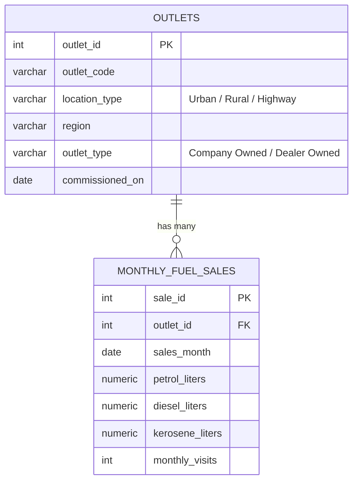

# BPCL Fuel Distribution & Outlet Segmentation — SQL Analytics Pipeline

**A SQL-native analytics pipeline that segments a fuel-retail network, quantifies revenue concentration, flags operational anomalies, and produces a supply-allocation priority score — built entirely in PostgreSQL, with no external BI tool or Python step required to reproduce a single number.**

> This project began as a Python/pandas + scikit-learn (K-Means) customer-segmentation notebook. It was deliberately rebuilt end-to-end as a SQL-native pipeline to demonstrate the skill that actually drives day-to-day decisions on a Business Analyst team: turning raw transactional data into a decision, using the tool the team already runs on.

---

## 1. Business Problem

Bharat Petroleum Corporation Limited (BPCL) supplies fuel to a large network of petrol pumps ("outlets") spread across urban, rural, and highway locations. Demand varies sharply across these outlets because of differences in customer behaviour, traffic patterns, and logistics usage. In practice this creates three recurring problems:

1. Fuel is not always distributed to where demand is actually highest.
2. Inventory / replenishment planning is reactive rather than data-driven.
3. High-value outlets and at-risk (underperforming or anomalous) outlets are not consistently identified.

**Objective:** segment outlets by demand pattern, quantify how revenue is concentrated across the network, statistically flag outlets behaving abnormally, and produce a supply-priority score that can plug directly into a monthly fuel-allocation decision — all reproducible with SQL alone.

## 2. Why SQL, and why not K-Means?

The original version of this project used scikit-learn's K-Means to cluster outlets. That's a reasonable data-science exercise, but it has two practical weaknesses in a real BA context: it requires a Python environment most stakeholders can't run themselves, and a cluster assignment from an unsupervised algorithm is hard to explain to a non-technical audience ("why is outlet #114 in cluster 2?").

This version replaces it with **percentile- and business-rule-based segmentation**, computed with window functions (`NTILE`, `PERCENT_RANK`) directly on the metrics that actually drive supply decisions: revenue, visit frequency, and diesel share. Every outlet's segment is fully explainable from its own numbers — "this outlet is in the top revenue quartile and in the top 25% by diesel share, so it's flagged as a logistics-heavy strategic account" — which matters far more in a business review than a marginal gain in a similarity metric. It's also the way segmentation is actually done in most BI/warehouse environments in practice.

A pure-SQL approximation of K-Means is still included as an **optional appendix** (Appendix A in the SQL file) purely to show the underlying technique can be reproduced natively in SQL — it is intentionally *not* part of the production pipeline.

## 3. Data Model

Two tables, modelled the way this would actually live in a warehouse (star-schema style) rather than as one flat spreadsheet-shaped table:



**On the data:** BPCL's real transactional data is confidential and cannot be used here. The dataset is transparently synthetic — 150 outlets × 6 trailing months (900 rows) — but engineered to reflect realistic, well-documented industry patterns rather than pure noise: higher diesel demand on highway corridors (freight/logistics), higher visit frequency in urban retail outlets, and lower but steadier volumes in rural areas. Values are drawn from a Gaussian approximation (`synth_normal()`, implemented via the classic sum-of-twelve-uniforms trick) parameterised per location type, and a fixed random seed (`setseed(0.42)`) makes every run — and every number quoted in this README — exactly reproducible.

## 4. Pipeline Walkthrough

The full pipeline lives in one file, [`BPCL_Fuel_Distribution_SQL_Analytics.sql`](./BPCL_Fuel_Distribution_SQL_Analytics.sql), organized into 11 numbered sections plus an appendix:

| # | Section | What it does |
|---|---|---|
| 1 | Schema Design | `outlets` dimension + `monthly_fuel_sales` fact table, indexed and constrained |
| 2 | Synthetic Data Generation | 150 outlets, 900 outlet-months, location-aware demand profiles, seeded for reproducibility |
| 3 | Feature Engineering (views) | `total_fuel_liters`, `fuel_per_visit`, `diesel_ratio`, `estimated_revenue`, MoM trend via `LAG()` |
| 4 | Exploratory Data Analysis | Demand profile and variability by location type |
| 5 | **Outlet Segmentation (core)** | `NTILE`/`PERCENT_RANK`-driven business segments — fully explainable, no black box |
| 6 | Segment KPIs | Revenue contribution and outlet count per segment |
| 7 | Pareto (80/20) Analysis | How concentrated is revenue across the network? |
| 8 | Anomaly Detection | Z-score vs. location-type peer group, per outlet-month |
| 9 | Supply-Chain Priority Scoring | Weighted composite score (revenue + diesel share + growth trend) |
| 10 | Executive Summary & Action Queue | Leadership rollup + the actual shortlist an ops manager should call this week |
| 11 | Business Recommendations | Narrative recommendations tied directly to the query outputs above |
| A | *(Appendix, optional)* Pure-SQL K-Means | Demonstrates the ML logic is reproducible natively in SQL, for technical depth |

The segmentation logic at the core of the project (Section 5):

```sql
CASE
    WHEN revenue_quartile = 4 AND diesel_percentile >= 0.75
        THEN 'Strategic High-Volume (Diesel/Logistics)'
    WHEN revenue_quartile = 4
        THEN 'Strategic High-Volume'
    WHEN frequency_quartile = 4 AND revenue_quartile <= 2
        THEN 'High-Frequency / Low-Ticket Retail'
    WHEN diesel_percentile >= 0.75 AND revenue_quartile IN (2, 3)
        THEN 'Diesel-Heavy Logistics Hub'
    WHEN revenue_quartile = 1 AND frequency_quartile = 1
        THEN 'Underperforming / Needs Review'
    ELSE 'Steady Mid-Tier Outlet'
END AS business_segment
```

And the anomaly check (Section 8) — flags any outlet-month more than 2 standard deviations from its own location-type peer group in that month:

```sql
SELECT *,
    ROUND((total_fuel_liters - peer_mean) / NULLIF(peer_stddev, 0), 2) AS z_score,
    (ABS((total_fuel_liters - peer_mean) / NULLIF(peer_stddev, 0)) >= 2) AS is_anomaly
FROM stats;
```

## 5. Key Insights (from an actual run of this script)

**Demand profile by location type**

| Location | Outlets | Avg. Monthly Fuel (L) | Avg. Monthly Visits | Diesel Share | Avg. Monthly Revenue (₹) |
|---|---|---|---|---|---|
| Highway | 60 | 7,873 | 174 | 64.3% | 727,234 |
| Urban   | 45 | 6,492 | 298 | 31.3% | 614,138 |
| Rural   | 45 | 3,488 | 138 | 34.3% | 313,103 |

Highway outlets move the most fuel and generate the most revenue per outlet despite having the *fewest* visits — confirming they're bulk/logistics-driven, not retail-driven, and need a different replenishment cadence than urban outlets.

**Segment-level revenue contribution** (150 outlets, ₹512.2M in trailing 6-month revenue)

| Segment | Outlets | Revenue Share |
|---|---|---|
| Steady Mid-Tier Outlet | 44 | 28.3% |
| Strategic High-Volume (Diesel/Logistics) | 26 | 22.8% |
| High-Frequency / Low-Ticket Retail | 26 | 18.3% |
| Underperforming / Needs Review | 31 | 11.2% |
| Diesel-Heavy Logistics Hub | 12 | 9.8% |
| Strategic High-Volume | 11 | 9.6% |

The two "Strategic" segments (37 outlets, 24.7% of the network) generate **32.4% of total revenue** — a meaningful but not extreme concentration, which is itself a useful finding: this network isn't a classic 80/20 business, so supply strategy needs to protect a broader base of outlets than "just the top handful."

**Pareto concentration:** it takes **100 outlets (66.7% of the network)** to reach 80% of total revenue — again indicating a fairly evenly-distributed demand base rather than a small number of mega-outlets.

**Anomaly detection:** **40 outlet-months** (out of 900, ≈4.4%) were flagged with `|z-score| ≥ 2` against their location-type peer group — including two deliberately-injected disruptions (a diesel supply spike and a footfall collapse) used to validate the detection logic actually works, alongside naturally-occurring statistical outliers.

**Supply priority queue:** **38 outlets** were scored "High" priority for the next allocation cycle — dominated, as expected, by Highway outlets in the diesel-heavy strategic segment. **25 outlets** appear in the final action queue (High/Medium priority *and* currently anomalous) — the actual, short, operational list this pipeline is designed to hand to a supply planning team every month.

## 6. Business Recommendations

1. **Protect the core.** The two "Strategic High-Volume" segments drive nearly a third of network revenue from a quarter of the outlets — guarantee their monthly allocation and prioritize them in any shortage scenario.
2. **De-risk logistics corridors separately from retail.** Diesel-heavy highway outlets stock out faster under any disruption and should run on a shorter replenishment cycle than retail-cadence urban outlets.
3. **There's real upside in "High-Frequency / Low-Ticket Retail."** These outlets already bring the customers in — a loyalty or subscription-style program converts frequency into higher basket size without needing new footfall.
4. **Investigate, don't write off, "Underperforming" outlets.** 31 outlets (11% of revenue) may reflect a fixable local/operational issue rather than permanently low demand — worth a site-level review before deprioritizing.
5. **Run the Action Queue monthly.** Section 10.2 of the SQL file is the one query that turns this whole pipeline from a one-off analysis into a repeatable operational process.

## 7. How to Run

```bash
createdb bpcl_analytics
psql -d bpcl_analytics -f BPCL_Fuel_Distribution_SQL_Analytics.sql
```

Requires PostgreSQL 13+. The script is fully idempotent (safe to re-run — it drops and recreates its own tables/views) and self-contained: running it end-to-end creates the schema, generates the seeded synthetic dataset, builds every view, and prints the output of every analytical section, finishing with the executive summary and action queue.

## 8. Skills Demonstrated

- Relational schema design (dimension/fact modelling, keys, constraints, indexing)
- Window functions: `NTILE`, `PERCENT_RANK`, `LAG`, running `SUM() OVER`
- CTEs and layered, reusable views (feature engineering → segmentation → KPIs → executive reporting)
- Statistical methods in pure SQL: Z-score anomaly detection, Pareto/80-20 analysis
- Composite, weighted business scoring logic, with the weights documented as a business decision rather than hidden in a model
- PL/pgSQL (custom `synth_normal()` function for reproducible synthetic-data generation)
- Translating an ML workflow (K-Means) into an interpretable, business-rule-driven alternative — and knowing when that trade-off is the right call

## 9. Possible Extensions

- Port the pipeline to BigQuery or Snowflake to demonstrate cloud-warehouse SQL dialects
- Connect the executive-summary and segment views to a BI tool (Looker Studio / Power BI) for a live dashboard layer
- Extend the fact table with real seasonal patterns (e.g., festival-season demand spikes) to stress-test the anomaly detection logic

---

*This is a portfolio project built on synthetic data for demonstration purposes. It is not affiliated with or endorsed by Bharat Petroleum Corporation Limited.*
